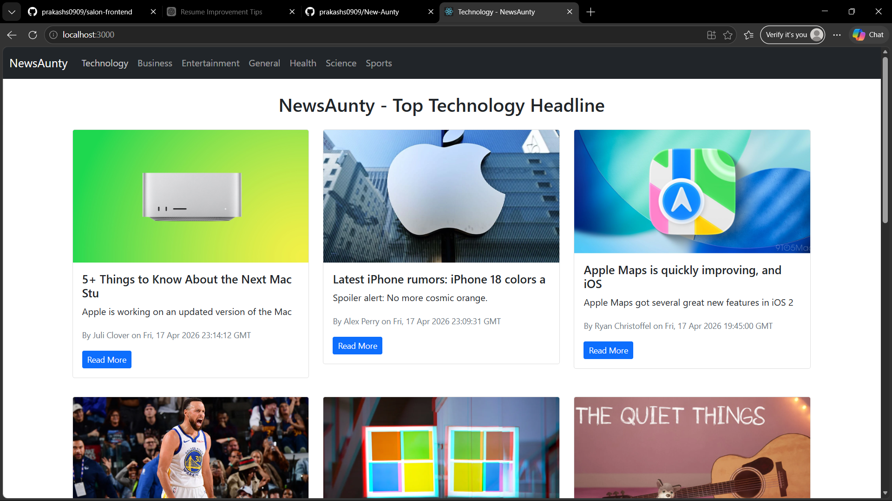
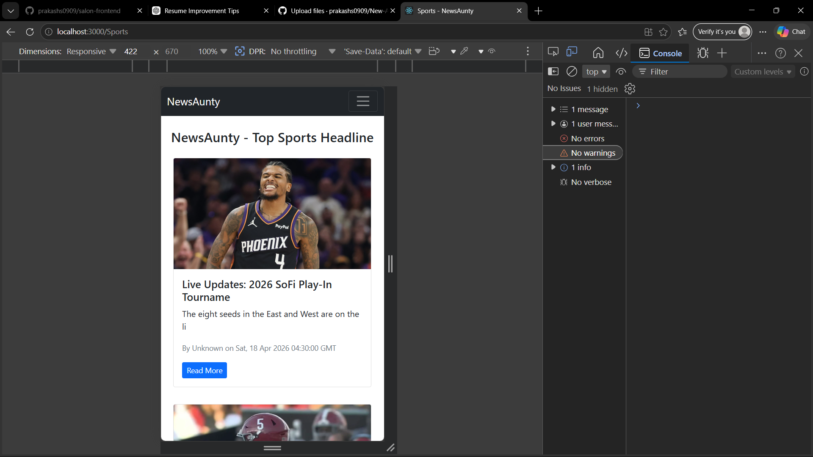

# 📰 News Aunty  

🚀 A dynamic news platform that delivers real-time news across multiple categories.  
Tagline: *"Bringing the World to Your Screen"*  

---

## 📂 GitHub Repository  
https://github.com/prakashs0909/New-Aunty  

---

## ✨ Features  

- Fetches real-time news using News API  
- Category-based filtering  
- Pagination for smooth navigation  
- Responsive design  

---

## 🛠 Tech Stack        

- React.js  
- JavaScript  
- News API  
- Bootstrap  

---

## 📸 Screenshots

<p align="center">
  
  
</p>


## ⚙️ Installation & Setup

### 1. Clone the repository

```bash
git clone https://github.com/prakashs0909/New-Aunty.git
cd New-Aunty
```

### 2. Install dependencies

#### Start

```bash
npm install
npm start
```

---


## ⭐ Show your support

If you like this project, please ⭐ the repo!
